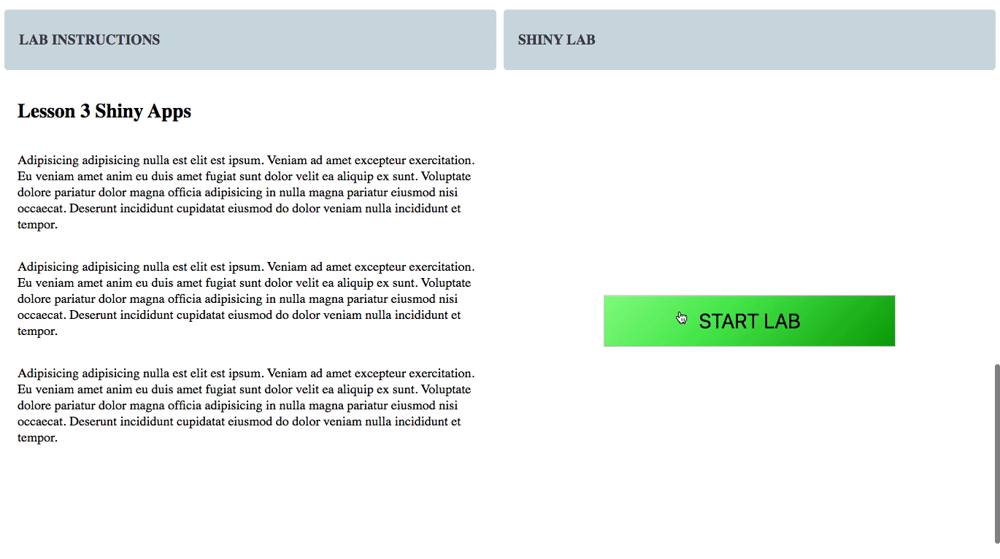

# Containers on Demand

This project aims to be a solution for allowing students to create individualized instances of workspaces such as Jupyter Notebooks, RStudio, etc. on demand.




## Run the demo

Clone this repo

```bash
git clone https://github.com/heyMP/containers-on-demand.git && cd containers-on-demand
```

Update the example Docker images.

```
docker pull heymp/notebook
docker pull heymp/rstudio
```

Run docker compose

```bash
docker-compose -f docker-compose.yml -f docker-compose-demo.yml up --build
```

Visit the demo http://demo.docker.localhost (in Chrome!). Chrome automatically resolves localhost domains needed for the demo.


## Specify Whitelist of Docker Images

Use the REGISTRY_WHITELIST environment variable to whitelist your docker images.

- `^(?!.*[\/| ]).*$` Accepts all docker hub maintained images 
- `^heymp\/` Accepts all `heymp` images
- `^rocker\/rstudio$` Accepts just `rocker/rstudio` image

```bash
REGISTRY_WHITELIST="^(?!.*[\/| ]).*$, ^heymp\/, ^rocker\/rstudio$"
```

## Development

```bash
docker-compose -f docker-compose-dev.yml -f docker-compose-demo.yml up --build
```

## Server Settings

I'm going off of the Traefik recommendations for setting up the server for high traffic. https://docs.traefik.io/v1.4/benchmarks/

```
bash ./system/settings.sh
```

